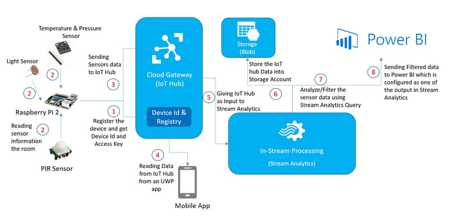
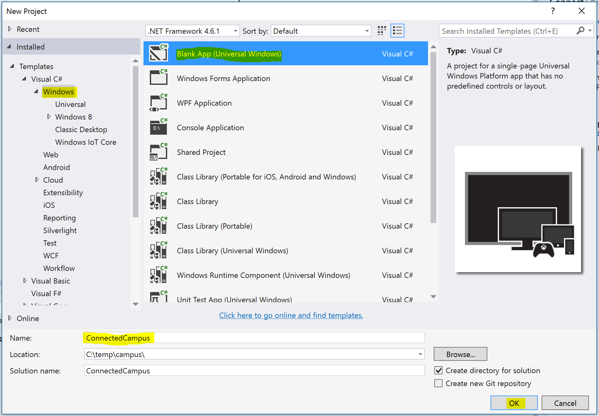
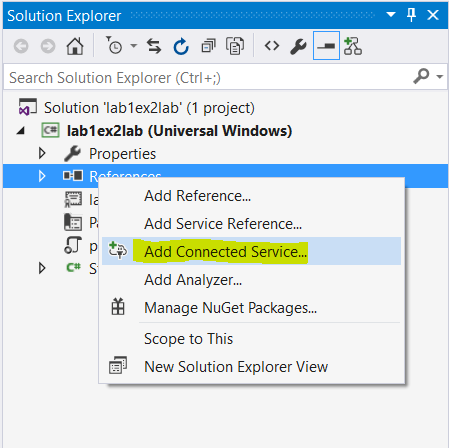

# Connected Campus


Scenario
========

In this scenario you will build an application for a Windows 10 Core device with several attached sensors.
Every 10 seconds it will send information about the environmental conditions of a room in which it is located to Azure.
This data will then be displayed on a dashboard where the user can see if the room is free and wether they wish to use it or not.

Credits: Full credits for this scenario go to:

* [Intelligent Multi-Conference Room using UWP App and Azure](https://microsoft.hackster.io/en-US/Kishore10211/intelligent-multi-conference-room-using-uwp-app-and-azure-620b1d) - Made by [Kishore Gaddam](https://microsoft.hackster.io/en-US/Kishore10211).

Additional content has been added by

* [Microsoft Premier Services](https://www.microsoft.com/en-us/microsoftservices/support.aspx).

Architecture
============

The system you are about to build consists of the following parts/will work in the following manner:

1. __An IoT Hub__. This will act as the main gateway for ingesting data from connected devices. You will need to register your device with IoT Hub before you can send it data.
2. A __Raspberry Pi__ with attached sensors. A motion sensor will be used determine wether anybody is in the room with light and temprature data being collected via appropriate sensors.
3. The collected data will be uploaded to IoTHub.
4. An application will be created to allow the viewing of the raw data once it has been uploaded.
5. The raw data will be feed into __Azure Stream Analytics__ to produce averages of temprature overtime.
6. A copy of the processes data will be archived into an Azure Storage Account.
7. The processed data will be filtered to suit our business needs.
8. The final data will be sent to __Power BI__ for display. This will make it easly available to view on a number of mobile devices or computers.



Basic Hardware Setup
====================

__TODO - This section needs reviewing and updating__

You will need the following hardware items to build this scenario:

* Raspberry Pi
* Breadboard (generic)
* PIR Motion Sensor
* Adafruit BMP280 Barometric Pressure & Altitude Sensor
* MCP3008 - 8-Channel 10-Bit ADC With SPI Interface
* Potentiometer - 10K
* Resistor 10k ohm
* An LED
* Male/Male Jumper Wires
* Female/Male Jumper Wires

[Click Image to Open it it's own tab - ](https://raw.githubusercontent.com/UKNorthernlad/AzureFastStartForIoT/master/Connected%20Campus/images/circuit.png)


Azure Pre-reqs
==============

1. XXX
2. XXX

Develoment Machine and IoT device Setup
========================================

* Ensure your local development machine is setup according to these instructions: [Azure IoT Development machine setup](../IoT Developer Setup.docx?raw=true)
* Part of the above document describes installing the "Device Explorer" tool - make sure that you *do* follow these instructions as you'll need that tool later on.
* Ensure you have installed the [Connected Service for Azure IoTHub Visual Studio Extension](https://marketplace.visualstudio.com/items?itemName=MicrosoftIoT.ConnectedServiceforAzureIoTHub)
* Ensure you have [followed the instructions](https://developer.microsoft.com/en-us/windows/iot/docs/iotdashboard) to __Use the Windows 10 IoT Core Dashboard__ to setup your Raspberry Pi.

*Note about setting up Wi-Fi on the RPi:* IoT Dashboard shows all available networks that your PC has previously connected to. If you don’t see your desired Wi-Fi network on the list, ensure you’re connected to it on your PC. If you uncheck the Wi-Fi box when writing the Windows 10 IoT Core image onto your SD card, you must connect an Ethernet cable to your board after flashing. Wether using Wi-Fi or Ethernet, your device will recieve an IP via DHCP at start up.

For more in depth guidance on setting up your hardware device see [Get Started](https://developer.microsoft.com/en-us/windows/iot/GetStarted).

Step 1 - Build an IoT Hub
=========================

1. [Open th Azure Portal](https://portal.azure.com).
2. Click (+)-->Internet of Things-->IoT Hub.
3. 
4. Enter a unique name for the IoT Hub, choose a Pricing and Scale tier (note that Free has been choosen here), select or create a Resource Group and datacentre location and __Click Create__.
5. 
6. Once the IoTHub has been created, ensure to make a copy of the Connection String - this is shown via the *Shared Access Policies-->iothubowner* blade.
7. 

Step 2 - Register your device with IoT Hub
==========================================

For your device to connect to IoT Hub it must have its own Device Identity (aka set of credentials). The process of obtaining these is known as Registering your Device. Currently there is no way to do this via the Azure Portal but there is a remote API available. Rather than write a custom application to connect & register you are going to use Device Explorer which is part of the IoT SDK. You can also register a device via the IoT Dashboard application or use iothub-explorer, another tool from the IoT SDK written in node.js.

1.	Open the Device Explorer (*C:\Program Files (x86)\Microsoft\DeviceExplorer\DeviceExplorer.exe*) and fill the IoT Hub Connection String field with the connection string of the IoT Hub you created in previous steps and click on Update.
2. 
3. Go to the __Management tab__ and __Click on the Create button__. The Create Device popup will be displayed. Make up a Device ID for your device (myFirstDevice for example) and __click on Create__.
4. 
5. Once the device identity is created, it will be displayed in the grid. Right click on the identity you just created, select __Copy connection string__ for selected device and take note of the value copied to your clipboard, since it will be required to connect your device with the IoT Hub.
6. 

__Note__: The device identities registration can be automated using the Azure IoT Hubs SDK. An example can be found at https://azure.microsoft.com/en-us/documentation/articles/iot-hub-csharp-csharp-getstarted/#create-a-device-identity. 


Step 3 - Create an UWP App for your device
==========================================

This application will read the sensor date from your device and upload it to IoT Hub.

A [Completed Example](source/DeviceApp) is also available. __TODO__: Add details on how to set this up and use it.

1. Open Visual Studio then go *File->Project->Visual C#->Windows->Windows IoT Core* and select the *Background Application (IoT)* template.
2. 
3. Call your project "ConnectedBackApp" and make sure the .NET Framework version is 4.5.1 or later. Click __Create__. Accept the defaults for Universal Windows Project target versions.
4. [Follow these instructions to add a NuGet reference](/Developer Setup/NuGet Package Install.md) to the __Microsoft.Azure.Devices.Client__ package.
5. Right click on References in the Solution Explorer and choose “Connected Service”.
6. 
7. Choose __Azure IoT Hub__ and press __Configure__ then select the option to __hardcode__ shared access keys in the applications code, then press OK.
8.  
9. The wizard will now search for IoT Hubs available in your subscription, find the one you created previously and click __Add__.
10. 
11. Select the device you registered earlier then click OK.
12. 
* A new file __AzureIoTHub.cs__ has been added to your Visual Studio project along with several Nuget packages which reference the Azure IoT SDK. This file contains the boiler-plate code that you can immediately invoke in your application.
The AzureIoTHub class contains two methods that you can start using right away from your own classes:
*    A method to send messages - __SendDeviceToCloudMessageAsync()__
*    A method to start listening for incoming messages - __ReceiveCloudToDeviceMessageAsync()__
* You can call these methods from elsewhere in your project.
* The Connected Service Wizard has inserted into the new class a __deviceConnectionString__ variable that contains the access key required to connect your device to IoT Hub. Anyone who comes into the possession of this information will be able to send and receive messages on behalf of that device. It is recommended that you remove this string from the source code before committing your code into a source control. Consider storing it in a configuration file or an environment variable.
13. Replace the entire StartupTask class with the following code:-  __TODO: Describe what it does__
```
public sealed class StartupTask : IBackgroundTask
    {
        #region Constants and variables

        // This should really be read from a config file.
        private string deviceName = "device1";

        // These defined GPIO pins on which the movement sensor and status LED will be connected.
        private const int ledPin = 5;
        private const int pirPin = 6;
        private GpioPin led;
        private GpioPin pir;

        // These represent the two sensors, i.e. the pressure/temp (BMP280) & light detector (MCP3008).
        private BMP280 bmpsensor;
        private MCP3008 mcp3008;

        // These hold the results of all the sensor data.
        private MCP3008SensorData adcSensorData;
        private BMP280SensorData bmpSensorData;

        float currentTemperature = 0;
        float currentPressure = 0;

        // Use for configuration of the MCP3008 class voltage formula
        const float ReferenceVoltage = 5.0F; // The MCP3008 works on a 5v reference voltage.

        // Values for which channels we will be using from the ADC chip
        const byte LowPotentiometerADCChannel = 0;
        const byte HighPotentiometerADCChannel = 1;
        const byte CDSADCChannel = 2;

        // Some strings to let us know the current state.
        const string JustRightLightString = "Bright";//Ah, just right
        const string LowLightString = "Dark";//I need a light
        const string HighLightString = "Too Bright";

        // Some internal state information
        enum eState { unknown, JustRight, TooBright, TooDark };
        eState CurrentState = eState.unknown;
        #endregion

        public async void Run(IBackgroundTaskInstance taskInstance)
        {
            // Using BackgroundTaskDeferral
            // as described in http://aka.ms/backgroundtaskdeferral
            BackgroundTaskDeferral deferral = taskInstance.GetDeferral();

            bmpsensor = new BMP280();
            await bmpsensor.Initialize();

            mcp3008 = new MCP3008(ReferenceVoltage);
            mcp3008.Initialize();

            InitGPIO();

            bmpSensorData = new BMP280SensorData();
            adcSensorData = new MCP3008SensorData();

            string roomstatus = String.Empty;

            while (true)
            {
                Debug.WriteLine("Reading taken at " + DateTime.UtcNow);

                #region Read pressure and temperature data from sensor
                bmpSensorData.Temperature = await bmpsensor.ReadTemperature();
                bmpSensorData.Pressure = await bmpsensor.ReadPreasure();           
                Debug.WriteLine(bmpSensorData.Temperature + " deg C");
                Debug.WriteLine(bmpSensorData.Pressure + " Pa");
                Debug.WriteLine(bmpSensorData.Pressure / 100000 + " Bar");
                Debug.WriteLine(bmpSensorData.Pressure / 100 + " milliBar");
                #endregion

                #region Reading Lighting Information from Sensor  
                adcSensorData = ReadLightStatusInRoom();
                Debug.WriteLine("Light Status in Room: " + adcSensorData.lightStatus);
                #endregion

                #region Read the motion sensor
                // If sensor pin is high, then motion was detected
                if (pir.Read() == GpioPinValue.High)
                {
                    // turn on the LED
                    led.Write(GpioPinValue.Low);
                    Debug.WriteLine("Motion detected - Room is occupied");
                    roomstatus = "Occupied";
                    
                }
                else
                {
                    // turn off the LED
                    led.Write(GpioPinValue.High);
                    Debug.WriteLine("No motion detected - Room is vacant");
                    roomstatus = "Vacant";
                }
                #endregion

                await SendDeviceToCloudMessageAsync(roomstatus, bmpSensorData, adcSensorData);

                await Task.Delay(10000);

            }

           // Once the asynchronous method(s) are done, close the deferral.
           // deferral.Complete();
        }

        #region Private methods
        private void InitGPIO()
        {
            // get the GPIO controller
            var gpio = GpioController.GetDefault();
            

            // return an error if there is no gpio controller
            if (gpio == null)
            {
                led = null;
                Debug.WriteLine("There is no GPIO controller.");
                return;
            }

            Debug.WriteLine("GPIO is Ready. Pin Count = " + gpio.PinCount);

            // set up the LED on the defined GPIO pin
            // and set it to High to turn off the LED
            led = gpio.OpenPin(ledPin);
            led.Write(GpioPinValue.High);
            led.SetDriveMode(GpioPinDriveMode.Output);

            // set up the PIR sensor's signal on the defined GPIO pin
            // and set it's initial value to Low
            pir = gpio.OpenPin(pirPin);
            pir.SetDriveMode(GpioPinDriveMode.Input);

            Debug.WriteLine("GPIO pins initialized correctly.");
        }
        private MCP3008SensorData ReadLightStatusInRoom()
        {
            var MCP3008SensorData = new MCP3008SensorData();
            try
            {
                if (mcp3008 == null)
                {
                    Debug.WriteLine("Light Sensor data is not ready");
                    MCP3008SensorData.lightStatus = "N/A";
                    return MCP3008SensorData;
                }

                // The new light state, assume it's just right to start.
                eState newState = eState.JustRight;

                // Read from the ADC chip the current values of the two pots and the photo cell.
                MCP3008SensorData.lowPotReadVal = mcp3008.ReadADC(LowPotentiometerADCChannel);
                MCP3008SensorData.highPotReadVal = mcp3008.ReadADC(HighPotentiometerADCChannel);
                MCP3008SensorData.cdsReadVal = mcp3008.ReadADC(CDSADCChannel);

                // convert the ADC readings to voltages to make them more friendly.
                MCP3008SensorData.lowPotVoltage = mcp3008.ADCToVoltage(MCP3008SensorData.lowPotReadVal);
                MCP3008SensorData.highPotVoltage = mcp3008.ADCToVoltage(MCP3008SensorData.highPotReadVal);
                MCP3008SensorData.cdsVoltage = mcp3008.ADCToVoltage(MCP3008SensorData.cdsReadVal);

                // Let us know what was read in.
                Debug.WriteLine(String.Format("Read values {0}, {1}, {2} ", MCP3008SensorData.lowPotReadVal,
                    MCP3008SensorData.highPotReadVal, MCP3008SensorData.cdsReadVal));
                Debug.WriteLine(String.Format("Voltages {0}, {1}, {2} ", MCP3008SensorData.lowPotVoltage,
                    MCP3008SensorData.highPotVoltage, MCP3008SensorData.cdsVoltage));

                // Compute the new state by first checking if the light level is too low
                if (MCP3008SensorData.cdsVoltage < MCP3008SensorData.lowPotVoltage)
                {
                    newState = eState.TooDark;
                }

                // And now check if it too high.
                if (MCP3008SensorData.cdsVoltage > MCP3008SensorData.highPotVoltage)
                {
                    newState = eState.TooBright;

                }

                // Use another method to determine what to do with the state.
                MCP3008SensorData.lightStatus = CheckForStateValue(newState);
                return MCP3008SensorData;
            }
            catch (Exception)
            {
                MCP3008SensorData.lightStatus = "N/A";
                return MCP3008SensorData;
            }

        }
        private string CheckForStateValue(eState newState)
        {
            String lightStatus;

            switch (newState)
            {
                case eState.JustRight:
                    {
                        lightStatus = JustRightLightString;
                    }
                    break;

                case eState.TooBright:
                    {
                        lightStatus = HighLightString;
                    }
                    break;

                case eState.TooDark:
                    {
                        lightStatus = LowLightString;
                    }
                    break;

                default:
                    {
                        lightStatus = "N/A";
                    }
                    break;
            }

            return lightStatus;
        }
        private async Task SendDeviceToCloudMessageAsync(string status, BMP280SensorData BMP280SensorData, MCP3008SensorData MCP3008SensorData)
        {
            ConferenceRoomDataPoint conferenceRoomDataPoint = new ConferenceRoomDataPoint()
            {
                DeviceId = deviceName,
                Time = DateTime.UtcNow.ToString("o"),
                RoomTemp = BMP280SensorData.Temperature.ToString(),
                RoomPressure = BMP280SensorData.Pressure.ToString(),
                RoomAlt = BMP280SensorData.Altitude.ToString(),
                LightStatus = MCP3008SensorData.lightStatus,
                LightCDSValue = MCP3008SensorData.cdsReadVal.ToString(),
                LightCDSVoltageValue = MCP3008SensorData.cdsVoltage.ToString(),
                RoomStatus = status
            };

            if (status == "Occupied")
            {
                conferenceRoomDataPoint.Color = "Red";
            }
            else
            {
                conferenceRoomDataPoint.Color = "Green";
            }


            var jsonString = JsonConvert.SerializeObject(conferenceRoomDataPoint);
            //var jsonStringInBytes = new Message(Encoding.ASCII.GetBytes(jsonString));

            await AzureIoTHub.SendDeviceToCloudMessageAsync(jsonString);
            Debug.WriteLine("{0} > Sending message: {1}", DateTime.UtcNow, jsonString);
        }
        #endregion
    }
```
14. Add a new class to the project by __Right-Clicking__ on the project name in *Solution Explorer* and choosing __Add->Class__. Call the new class __"MCP3008"__. 
15. Add the following code to the new *MCP3008.cs* file replacing the exising class defintion. *The light detector part of the circuit you built earlier produces a variable voltage however the Raspberry PI does not have a built-in Analog-To-Digital converter therefore it needs to use an external MCP3008 chip to do the work. The code you are about to add to the new class file knows how to read data from that chip and convert it into a value that can be used in the rest of the program.*
```
 class MCP3008
    {
        // Constants for the SPI controller chip interface
        private SpiDevice mcp3008;
        const int SPI_CHIP_SELECT_LINE = 0;  // SPI0 CS0 pin 24

        // ADC chip operation constants
        const byte MCP3008_SingleEnded = 0x08;
        const byte MCP3008_Differential = 0x00;

        // These are used when we calculate the voltage from the ADC units
        float ReferenceVoltage;
        public const uint Min = 0;
        public const uint Max = 1023;


        public MCP3008(float referenceVolgate)
        {
            Debug.WriteLine("MCP3008::New MCP3008");

            // Store the reference voltage value for later use in the voltage calculation.
            ReferenceVoltage = referenceVolgate;
        }

        /// <summary>
        /// This method is used to configure the Pi2 to communicate over the SPI bus to the MCP3008 ADC chip.
        /// </summary>
        public async void Initialize()
        {
            Debug.WriteLine("MCP3008::Initialize");
            try
            {
                // Setup the SPI bus configuration
                var settings = new SpiConnectionSettings(SPI_CHIP_SELECT_LINE);
                // 3.6MHz is the rated speed of the MCP3008 at 5v
                settings.ClockFrequency = 3600000;
                settings.Mode = SpiMode.Mode0;

                // Ask Windows for the list of SpiDevices

                // Get a selector string that will return all SPI controllers on the system 
                string aqs = SpiDevice.GetDeviceSelector();

                // Find the SPI bus controller devices with our selector string           
                var dis = await DeviceInformation.FindAllAsync(aqs);

                // Create an SpiDevice with our bus controller and SPI settings           
                mcp3008 = await SpiDevice.FromIdAsync(dis[0].Id, settings);

                if (mcp3008 == null)
                {
                    Debug.WriteLine(
                        "SPI Controller {0} is currently in use by another application. Please ensure that no other applications are using SPI.",
                        dis[0].Id);
                    return;
                }

            }
            catch (Exception e)
            {
                Debug.WriteLine("Exception: " + e.Message + "\n" + e.StackTrace);
                throw;
            }
        }

        /// <summary> 
        /// This method does the actual work of communicating over the SPI bus with the chip.
        /// To line everything up for ease of reading back (on byte boundary) we 
        /// will pad the command start bit with 7 leading "0" bits
        ///
        /// Write 0000 000S GDDD xxxx xxxx xxxx
        /// Read  ???? ???? ???? ?N98 7654 3210
        /// S = start bit
        /// G = Single / Differential
        /// D = Chanel data 
        /// ? = undefined, ignore
        /// N = 0 "Null bit"
        /// 9-0 = 10 data bits
        /// </summary>
        public int ReadADC(byte whichChannel)
        {
            byte command = whichChannel;
            command |= MCP3008_SingleEnded;
            command <<= 4;

            byte[] commandBuf = new byte[] { 0x01, command, 0x00 };

            byte[] readBuf = new byte[] { 0x00, 0x00, 0x00 };

            mcp3008.TransferFullDuplex(commandBuf, readBuf);

            int sample = readBuf[2] + ((readBuf[1] & 0x03) << 8);
            int s2 = sample & 0x3FF;
            Debug.Assert(sample == s2);

            return sample;
        }

        /// <summary>
        ///  Returns the ADC value (uint) as a float voltage based on the configured reference voltage
        /// </summary>
        /// <param name="adc"> the ADC value to convert</param>
        /// <returns>The computed voltage based on the reference voltage</returns>
        public float ADCToVoltage(int adc)
        {
            return (float)adc * ReferenceVoltage / (float)Max;
        }
    }

    public sealed class MCP3008SensorData
    {
        public int lowPotReadVal { get; set; }
        public int highPotReadVal { get; set; }
        public int cdsReadVal { get; set; }
        public float lowPotVoltage { get; set; }
        public float highPotVoltage { get; set; }
        public float cdsVoltage { get; set; }
        public string lightStatus { get; set; }
    }
```
16. Blah


######################


[Deploying an App with Visual Studio](https://developer.microsoft.com/en-us/windows/iot/Docs/appdeployment)