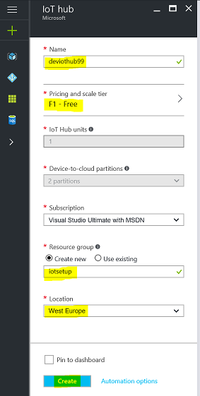

# Connected Campus

Scenario
========

In this scenario you will build an application for a Windows 10 Core device with several attached sensors.
Every 10 seconds it will send information about the environmental conditions of a room in which it is located to Azure.
This data will then be displayed on a dashboard where the user can see if the room is free and wether they wish to use it or not.

Credits: Full credits for this scenario go to:

* [Intelligent Multi-Conference Room using UWP App and Azure](https://microsoft.hackster.io/en-US/Kishore10211/intelligent-multi-conference-room-using-uwp-app-and-azure-620b1d) - Made by [Kishore Gaddam](https://microsoft.hackster.io/en-US/Kishore10211).

Additional content has been added by

* [Microsoft Premier Services](https://www.microsoft.com/en-us/microsoftservices/support.aspx).

Architecture
============

The system you are about to build consists of the following parts/will work in the following manner:

1. __An IoT Hub__. This will act as the main gateway for ingesting data from connected devices. You will need to register your device with IoT Hub before you can send it data.
2. A __Raspberry Pi__ with attached sensors. A motion sensor will be used determine wether anybody is in the room with light and temprature data being collected via appropriate sensors.
3. The collected data will be uploaded to IoTHub.
4. An application will be created to allow the viewing of the raw data once it has been uploaded.
5. The raw data will be feed into __Azure Stream Analytics__ to produce averages of temprature overtime.
6. A copy of the processes data will be archived into an Azure Storage Account.
7. The processed data will be filtered to suit our business needs.
8. The final data will be sent to __Power BI__ for display. This will make it easly available to view on a number of mobile devices or computers.

Basic Hardware Setup
====================

__TODO - This section needs reviewing and updating__

You will need the following hardware items to build this scenario:

* Raspberry Pi
* Breadboard (generic)
* PIR Motion Sensor
* Adafruit BMP280 Barometric Pressure & Altitude Sensor
* MCP3008 - 8-Channel 10-Bit ADC With SPI Interface
* Potentiometer - 10K
* Resistor 10k ohm
* An LED
* Male/Male Jumper Wires
* Female/Male Jumper Wires

Azure Pre-reqs
==============

1. XXX
2. XXX

Develoment Machine and IoT device Setup
========================================

* Ensure your local development machine is setup according to these instructions: [Azure IoT Development machine setup](../IoT Developer Setup.docx?raw=true)
* Ensure you have [followed the instructions](https://developer.microsoft.com/en-us/windows/iot/docs/iotdashboard) to __Use the Windows 10 IoT Core Dashboard__ to setup your Raspberry Pi.

*Note about setting up Wi-Fi on the RPi:* IoT Dashboard shows all available networks that your PC has previously connected to. If you don’t see your desired Wi-Fi network on the list, ensure you’re connected to it on your PC. If you uncheck the Wi-Fi box when writing the Windows 10 IoT Core image onto your SD card, you must connect an Ethernet cable to your board after flashing. Wether using Wi-Fi or Ethernet, your device will recieve an IP via DHCP at start up.

For more in depth guidance on setting up your hardware device see [Get Started](https://developer.microsoft.com/en-us/windows/iot/GetStarted).

Step 1 - Build an IoT Hub
=========================

1. [Open th Azure Portal](https://portal.azure.com).
2. Click (+)-->Internet of Things-->IoT Hub.
3. 
4. Enter a unique name for the IoT Hub, choose a Pricing and Scale tier (note that Free has been choosen here), select or create a Resource Group and datacentre location and __Click Create__.
5. 
6. Once the IoTHub has been created, ensure to make a copy of the Connection String - this is shown via the *Shared Access Policies-->iothubowner* blade.
7. 

[Deploying an App with Visual Studio](https://developer.microsoft.com/en-us/windows/iot/Docs/appdeployment)