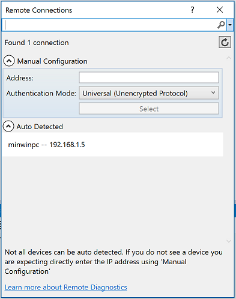
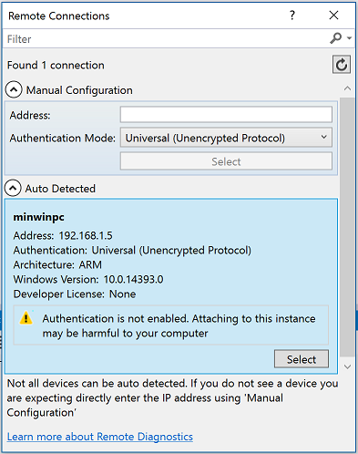

# Fraud Detection Scenario

Scenario
========

For this scenario you will imagine that you are building a cash machine/cash dispenser/ATM machine that authenticates customers by use of a PIN number AND a photo scan of their face.
You will attach a regular USB camera to your Windows IoT Core device and once a photo has been taken, the image will be uploaded to Azure where Cortana Analytics will use __Face Verification__ which is part of the [Face API](https://www.microsoft.com/cognitive-services/en-us/face-api/documentation/overview) to analyse the photo to determine if this is the correct person.

To concentrate on the Azure part of the scenario, you won't need to read a bank card or PIN number but instead, you will use a motion sensor which will be used to trigger the taking of a photograph when you move near the camera.
In a real system, the user would probably insert there bank card first, followed by their PIN number. This would allow a system to retrieve a "known" image of the user from a database, take a photo of them now then compare the two.

The Face API works by analysing exactly these two pictures, the first is of the "known" person, the second is the image being tested. Cortana will return a value informing you of have confident it is as to wether they match or not.
For the purposes of this excercise you will consider results of 75% probably (or more) to be a successful match.

Again to simplify the client code and concentrate on the Azure piece, you will upload a "known" photo of yourself to a folder on the device. This will simulate pulling your "known" image from a backend database.

Basic Hardware Setup
====================

__TODO - This section needs reviewing and updating__

1. Set up your PC and RPi according to these [instructions](http://ms-iot.github.io/content/en-US/win10/SetupPCRPI.htm). Make a note of the IP address of the device, you'll need it for later.
2. Wire the PIR sensor as shown in the image below being sure to use 10 kΩ pull-up resistor.

Azure Pre-reqs
==============

1. Create a new Azure Storge account via the https://portal.azure.com portal.
2. Open the settings for the new storage account and make a note of it's name and access key.
3. Create a new container in the Storage Account called *secuirtysystem-cameradrop*. This is where images will be uploaded to for processing. 

Software Setup
===============

__The following steps should be carried out on your development machine__ which has Visual Studio 2015 installed:

1. Create a new folder called `c:\source` to store the content you are about download.
2. Open the Command Prompt to navigate to the new folder.
3. Run the git clone command: `git clone https://github.com/UKNorthernlad/AzureFastStartForIoT.git` to download a copy of the class content. This contains a basic UWP application which takes photos and uploads them to Azure Blob Storage.
4. Change directory to the project root folder: `c:\source\AzureFastStartForIoT\Fraud Detection\CameraSystem\SecuritySystemUWP`.
5. Open the SecuritySystemUWP.sln solution file, in the SecuritySystemUWP folder, using Visual Studio 2015.
6. From the tool bar, choose "Remote Machine" as the target to deploy your application to.
7. 
8. From the pop-up dialog, you should see the name and IP of your device has been autodetected (*minwinpc -- 192.168.1.5* in this case), __click 'select'__  to set it as the target for deployment device. *If your device is not shown, you can manually enter the IP address being sure to use the default authentication mode (i.e. Universal - unencrypted). The chances are however that if you don't see your device appearing under "Auto Detected" then it 1) might not functioning correctly, 2) might not show up if you are accessing the device wirelessly - you either enter a IP address manually or connect the device via an ethernet cable.*
9.  
10. You'll now need to tell Visual Studio to compile the application for the ARM platform (which a requirement to run on the RPi). __Right-click__ on the name of your solution in Solution Explorer and choose *"Configuration Manager".* 
11. Set the *Active solution platform* setting to __ARM__. Click __Close__.
12. Right-click on the __com.microsoft.maker.SecuritySystem__ project and select "Build". This will download nuget packages and compile this project.
13. Repeat the process for the __OneDriveConnector__, __PirSensor__ and __UsbCamera__ projects. 
14. Finally repeat for the __SecuritySystemUWP__ project. *All projects should have built with out errors (some warnings about async methods might be seen - these can be ignored).*
15. You can now deploy and test the application by pressing `F5`. *The first time you deploy an application it make take some time as required framework updates are installed onto the device - Visual Studio may even display some "This is taking too long messages" - Be patient! Subsequent deployments will be much quicker.*

Configuring the Universal Windows App
=====================================

1. Use your web browser to navigate to http://*yourdeviceipaddress*:8000. You will see a landing page for your application running on your device.
2. Click on the "Settings" link from the left hand navigation menu.
3. Change the Storage type to *Azure* and enter the storage account name and key you saved from earlier. Other settings can be left either blank or at their defaults. __The web server built into the UWP app does not support secured connections so all information is received & sent in the clear - beware!__
4. Press *Save* at the bottom of the page.

Testing the App
===============

1. Take a selfie with your mobile phone. *Where possible make sure you are looking straight at the camera and there is nothing in the background of the image. Ideally your could ask another person to take the photo of you stood against a wall with a plain background. Ensure also the lighting in the room is good or if possible take the photo outside on bright sunny day. A good, clear and well light photograph will vastly increase the changes of a positive match.*
2. From Explorer, copy your "known" photo to the device by pasting it into the folder `\\*yourdeviceipaddress*\c$\Data\Users\DefaultAccount\Pictures\Camera Roll`. Name your "known" photo as `me.jpg`. The name and location are important as the code you'll create shortly will reference them.
3. Attach a USB webcam to the RPi, then wait a few seconds whilst Windows loads the drivers. *At the time of writing, the offical RaspberryPi camera is not supported on Windows 10 IoT Core :(*
4. Moving your hand in front of the motion sensor will cause the USB camera to take a photograph.
5. The image has been created in the Pictures folder on the device in a subdirector called XXXX. You can view the new file at http://*yourdeviceipaddress*:8000/gallery.htm or by browsing to \\*yourdeviceipaddress*\c$\Data\Users\DefaultAccount\Pictures\securitysystem-cameradrop\.
6. Every 60 seconds, these images are uploaded to the Azure blob container you created earlier. The originals on the device are deleted.

Manually Taking a Photograph
============================

You can manually trigger a the taking of a photo rather than relying on the motion sensor by clicking on the "Action" link on the nav menu, then clicking "Take Photo".

Adding Cortana Analytics Face API support
=========================================

The process of uploading your photos to Cortana Analytics is easy when you use the Face SDK as these pre-created libaries do all the heavy lifting for you.

You are now going to add new code to the camera project to support this.

0. If it is not already, open the SecuritySystemUWP.sln in Visual Studio. If it is still running in the debugger from previous, stop debugging now.
1. Right-click on the __SecuritySystemUWP__ *project* in Solution Explorer and click __Manage NuGet Packages...__.
2. In the NuGet dialog, press "Browse" then enter "Microsoft.ProjectOxford.Face" into the search box. Select the (probably) only result from the list then press "Install".
3. 
4. Blah

