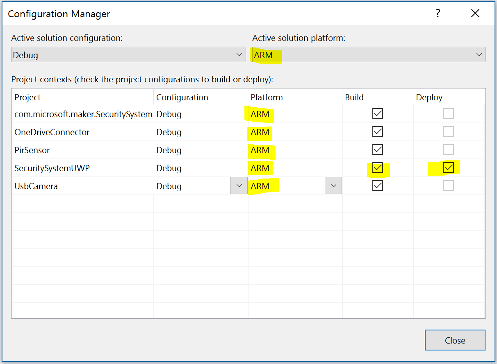
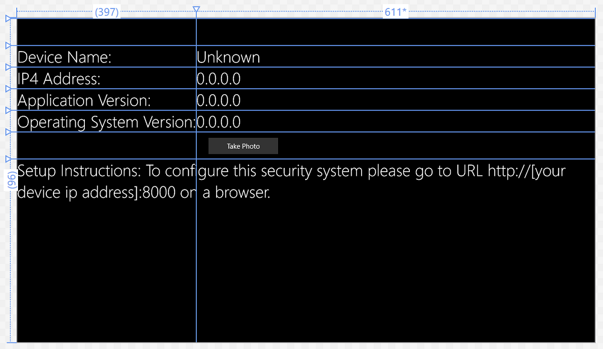

# Fraud Detection Scenario

Scenario
========

For this project you will attach a regular USB camera to your Windows IoT Core device along with a PIR sensor (the required hardware will have been supplied to you by your instructor).
This basic system will detect movement near the camera and trigger it to take a photograph. The image will be uploaded to Azure where Cortana Analytics will analyse the photo.
 __TODO: What will it do with it?__

Basic Hardware Setup
====================

* Set up your PC and RPi according to these [instructions](http://ms-iot.github.io/content/en-US/win10/SetupPCRPI.htm).
* Wire the PIR sensor as shown in the image below being sure to use 10 kΩ pull-up resistor.

Azure Pre-reqs
==============

* Create a new Azure Storge account via the https://portal.azure.com portal.
* Open the settings for the new storage account and make a note of it's name and access key.
* Create a new container called *secuirtysystem-cameradrop*. This is where images will be uploaded to for processing. 

Software Setup
===============

* Create a new folder to store the sample projects you'll soon download. Call this something short, e.g. c:\iotproject
* Use the Command Prompt to navigate to the new folder where you want the project: `cd c:\iotproject` 
* Run the git clone command: `git clone https://github.com/ms-iot/securitysystem.git` to download a copy of the basic UWP application which takes photos and uploads them to Azure Blob Storage.
* Change directory to the project root folder: `cd securitysystem`
* Next, get the submodules for the USB camera and the PIR sensor by running the following commands: `git submodule init` followed by `git submodule update`
* Open the SecuritySystemUWP.sln solution file, in the SecuritySystemUWP folder, using Visual Studio 2015.
* Right-click on the __com.microsoft.maker.SecuritySystem__ project and select "Build". This will download nuget packages and compile this project.
* Repeat the process for the __OneDriveConnector__, __PirSensor__ and __UsbCamera__ projects. 
* Finally repeat for the __SecuritySystemUWP__ project.
* All projects should have build with out errors (some warnings about async methods might be seen - these can be ignored).

* From the Solution Explorer, right-click on the Solution name (SecuritySystemUWP) and choose *Configuration Manager*.

__TODO: Create screen shot for building against ARM __

* From the top menu of Visual Studio, select Debug and ARM (if you are using a Raspberry Pi).
* Next click Build -> Clean Solution. Wait for the solution to clean successfully. 
* Select Remote Machine. You will have to enter your Remote Machine IP address and use "Universal (Unencrypted Protocol)" for Authentication Mode. *Use WindowsIoTCoreWatcher to find your IP address*.
* You can now deploy and test the application by pressing `F5`.

Configuring the Web App
=======================

* Use your web browser to navigate to http://yourdeviceipaddress:8000. You will see a landing page for your application running on your device.
* Click on the "Settings" link fron the left hand navigation menu.
* Change the Storage type to *Azure* and enter the storage account name and key you saved from earlier. Other settings can be left either blank or at their defaults.
* Press *Save* at the bottom of the page.

Testing the application
=======================

* Moving your hand in front of the PiR sensor will trigger the USB camera to take a photograph.
* The image is storaged in a folder in the Photos folders on the device. You can view it at http://yourdeviceipaddress:8000/gallery.htm
* Every 60 seconds, these images are uploaded to the Azure blob container you created earlier. The originals on the device are deleted.

Manually taking a photograph
============================

If you don't want to or can't setup the PiR detector, you can make a small change to the application to trigger a photo manually.

* Open the MainPage.xaml and add a button to the canvas wherever you want.
* Set it's content to "Take Photo".

* Double click the button to add and event handler, then add the following code

            ICamera cam = App.Controller.Camera;
            await cam.TriggerCapture();

* Rebuild and redeploy your application to your device. You might need to configure the application again with storage type, name and key.