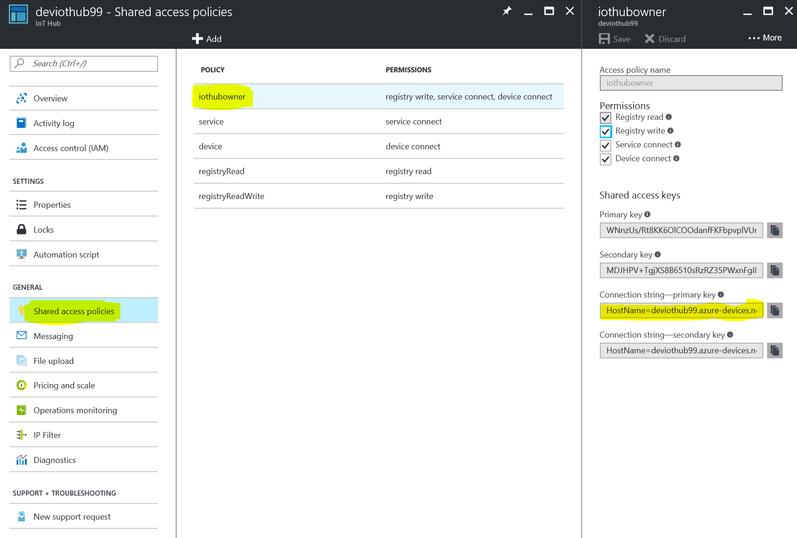
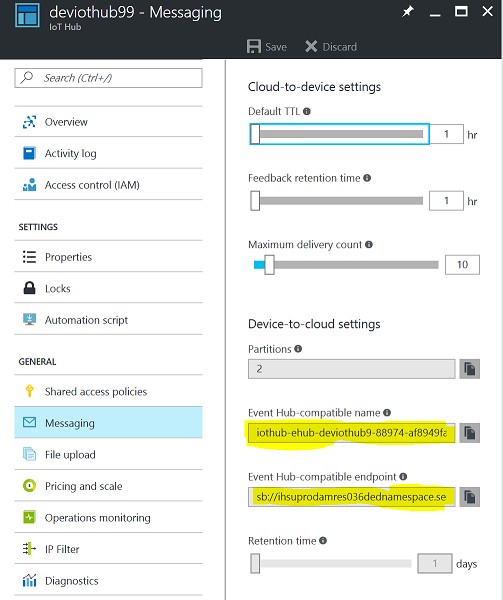
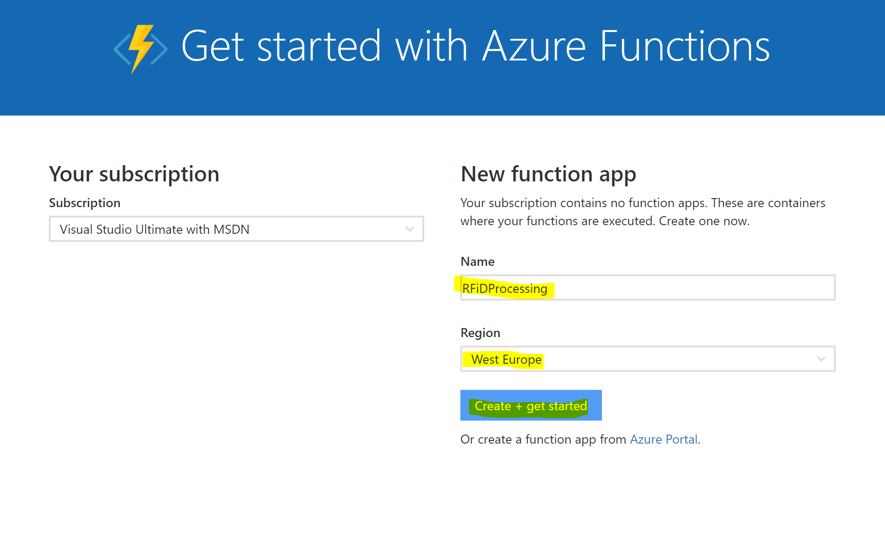
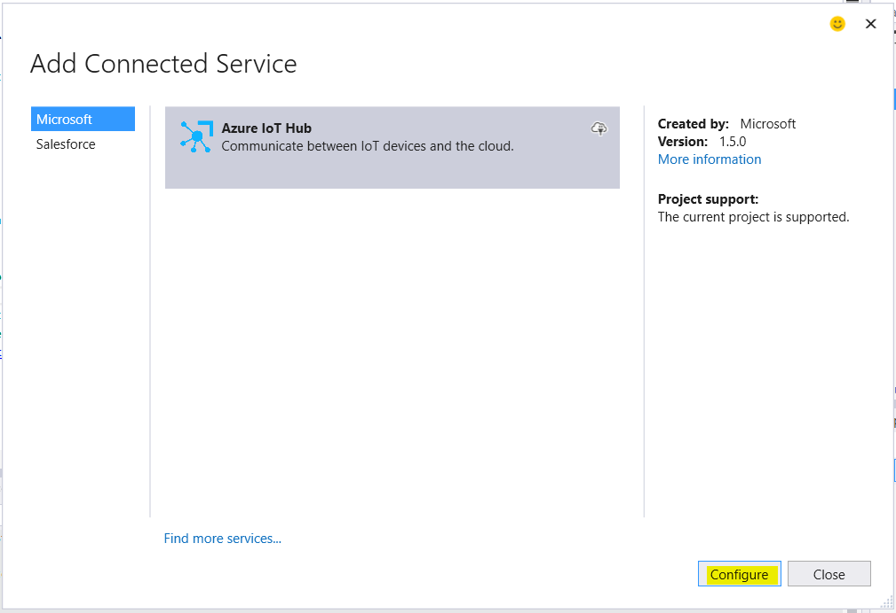
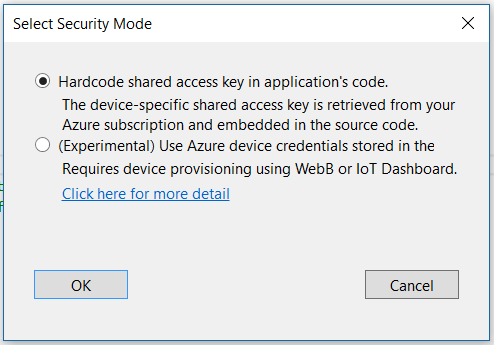
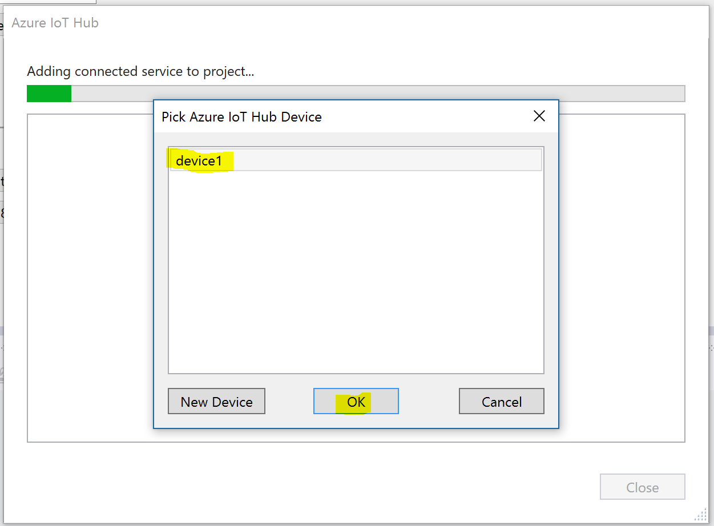
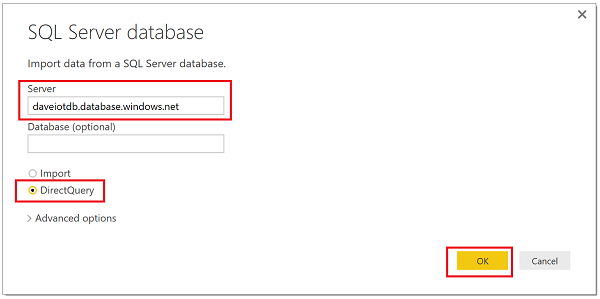

# Management System and Inventory

Scenario
========

In this scenario you will imagine that you are building a system to support a stocking taking programme in a warehouse. Employees will scan the tags of stock items before putting them into known locations. This information will then be uploaded to IoT Hub before being stored in a database for reporting purposes.

Credit for this project is as follows:-

* [Microsoft Premier Services](https://www.microsoft.com/en-us/microsoftservices/support.aspx).

Architecture
============

__TODO - Draw the overall architecture diagram in Visio __

Basic Hardware Setup
====================

As described in the [Kit List for these scenarios](/Electronics/Kit%20List.md), you will need the following hardware items to build this scenario:

* [Microsoft IoT Pack for Raspberry Pi 3 - w/ Raspberry Pi 3](https://www.adafruit.com/products/2733)
* [1 x USB cable - A/MicroB - 3ft](https://www.adafruit.com/product/592)
* [1 x Adafruit Assembled Pi Cobbler Breakout + Cable for Raspberry Pi - Model B](https://www.adafruit.com/product/914)
* __TODO - Add RFID Components here __

Specifically the following items are required from the kit list:

* Raspberry Pi
* Breadboard (generic)
* __TODO - Add RFID Components here __

## Basic Circuit

Build your basic cicuit according to this diagram:

For interest/reference, these are the PINs on the Raspberry Pi.

## "Here's one I made earlier"

Azure Pre-reqs
==============

1. A working Azure subscription or trial - http://portal.azure.com
2. A working PowerBI subscription or trial - http://www.powerbi.com
3. The PowerBI Desktop tool must be downloaded from https://powerbi.microsoft.com/en-us/desktop/ and installed on your development machine.

Develoment Machine and IoT device Setup
========================================

1. Ensure your local development machine is setup according to these instructions: [Azure IoT Development machine setup](../IoT Developer Setup.docx?raw=true).
2. Part of the above document describes installing the "Device Explorer" tool - make sure that you *do* follow these instructions as you'll need that tool later on.
3. Ensure you have installed the [Connected Service for Azure IoT Hub Visual Studio Extension](https://marketplace.visualstudio.com/items?itemName=MicrosoftIoT.ConnectedServiceforAzureIoTHub)
4. Ensure you have [followed the instructions](https://developer.microsoft.com/en-us/windows/iot/docs/iotdashboard) to __Use the Windows 10 IoT Core Dashboard__ to setup your Raspberry Pi.

*Note about setting up Wi-Fi on the RPi:* IoT Dashboard shows all available networks that your PC has previously connected to. If you don’t see your desired Wi-Fi network on the list, ensure you’re connected to it on your PC. If you uncheck the Wi-Fi box when writing the Windows 10 IoT Core image onto your SD card, you must connect an Ethernet cable to your board after flashing. Whether using Wi-Fi or Ethernet, your device will recieve an IP via DHCP at start up.

For more in depth guidance on setting up your hardware device see [Get Started](https://developer.microsoft.com/en-us/windows/iot/GetStarted).

Step 1 - Build an IoT Hub
=========================

You are going to start by building an IoT Hub that hand RFiD scanners carried by employees will upload their data to.

1. [Open the Azure Portal](https://portal.azure.com).
2. Click (+)-->Internet of Things-->IoT Hub.
    
3. Enter a unique name for the IoT Hub, choose a Pricing and Scale tier (note that Free has been choosen here), select or create a Resource Group and datacentre location and __Click Create__.
4. 
5. Once the IoTHub has been created, ensure you make a copy of the *iothubowner* Connection String - this is shown via the *Shared Access Policies-->iothubowner* blade.
      
6. Finally you should also make a copy of the *Event Hub-compatible name* & *Event Hub-compatible endpoint* values. You'll need these later on when you start to read data back from IoT Hub.
    
7. Done.

Step 2 - Create an Azure Database to store the data
===================================================

The details on how to create a new Azure SQL Database are very well documented and won't be copied here, instead you should browse to:

`https://docs.microsoft.com/en-us/azure/sql-database/sql-database-get-started`

and follow the instructions under the section __Create a new logical SQL server in the Azure portal__. You can call the logical database server whatever you want, just keep a record of the name and credetials your create for later. You don't need to create a new database as this will be done for you later by the Entity Framework however you will need to keep a record of the username and password.

Once your logical server has been created, you can build a connection string like this (replacing the server name, username and password placeholders with your own details).

`Server=tcp:YOUR_SERVER_NAME_HERE.database.windows.net,1433;Database=RFIDStock;User ID=YOUR_LOGIN_NAME_HERE;Password=YOUR_PASSWORD_HERE;Encrypt=True;TrustServerCertificate=False;Connection Timeout=30`

Make a note of this completed connection string as you'll need it next.

Step 3 - Setup an Azure Function to process incomming data
==========================================================

Azure functions are background jobs that run on web servers and process data. You are going to use one to read the data which has been sent to the IoT Hub then upload it into the database.

1. Open a browser at head to the [Azure Functions page](http://functions.azure.com).
2. __Click__ on the "Login to your account" link under the "Try it for Free" green button.
3. Enter a suitable *name* for the function, *a region*, then click *"Create"*.
    .
4. Next.

Step 4 - Build an application to upload the data
================================================

In this section you will build an application for your Windows 10 IoT device. This will emulate a typical hand help RFiD scanner that an operative in a warehouse would carry. Eachtime an item with an attached RFiD sticker is scanned, a small packet of data indicating the id, location and time/date will be uploaded to IoT Hub.

A [Completed Example](source/XXXXXX) is also available. __TODO__: Add details on how to set this up and use it.

1. Open Visual Studio then go *File->Project->Visual C#->Windows->Windows IoT Core* and select the *Background Application (IoT)* template.
    
2. Call your project "StockBackApp" and make sure the .NET Framework version is 4.5.1 or later. Click __Create__. Accept the defaults for Universal Windows Project target versions.
3. [Follow these instructions to add a NuGet reference](/Developer Setup/NuGet Package Install.md) to the __Microsoft.Azure.Devices.Client__ package.
4. Right click on References in the Solution Explorer and choose "Add Connected Service".
    
5. Choose __Azure IoT Hub__ and press __Configure__ then select the option to __hardcode__ shared access keys in the applications code, then press OK.
     
6. The wizard will now search for IoT Hubs available in your subscription, find the one you created previously and click __Add__.
    
7. Select the device you registered earlier then click OK.
    
    * A new file __AzureIoTHub.cs__ has been added to your Visual Studio project along with several Nuget packages which reference the Azure IoT SDK. This file contains the boiler-plate code that you can immediately invoke in your application. The AzureIoTHub class contains two methods that you can start using right away from your own classes:
    * A method to send messages - __SendDeviceToCloudMessageAsync()__
    * A method to start listening for incoming messages - __ReceiveCloudToDeviceMessageAsync()__
    * You can call these methods from elsewhere in your project.
    * The Connected Service Wizard has inserted into the new class a __deviceConnectionString__ variable that contains the access key required to connect your device to IoT Hub. Anyone who comes into the possession of this information will be able to send and receive messages on behalf of that device. It is recommended that you remove this string from the source code before committing your code into a source control. Consider storing it in a configuration file or an environment variable.

Step 5 - View the captured data
================================

In order to view the captured data, you will use PowerBI to build a report which displays the current and historical locations of items from the warehouse.

1. Open PowerPI Desktop and click on __Get Data__.
    .
2. Select *Azure->Microsoft Azure SQL Database* and press __Connect__
    .
3. Enter your Azure logical SQL Server name as created in a previous step.
     .
4. Select the "StockItems" table, then click __Load__.
     .

You now have the data source added, all that remains is to display the data. In this simple example you simply display all the data in the database however the scenario could be extened to show only the most recent location.

1. Click on the *Name* column box under the StockItems table on the Fields pane. This will add it to a report on the main report canvas. If there is any data in the database it will be queriered now and displayed.
     .
2. Now add ticks to the *LastSeen*, *Location* and *RFiD* columns.

