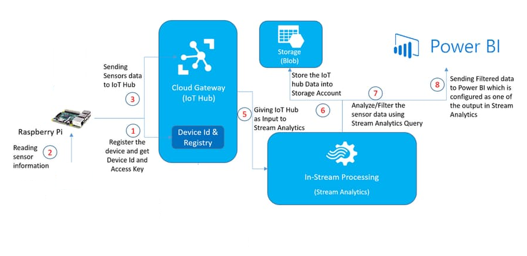

# Predictive Maintenance

Scenario
========

In this scenario, you will build a system which uses an external sensor to detect oil levels in a piece of machinery and relays the information to Azure.
The collected data will be used to proactively detect impending maintenance issues and send control signals back to the device.
This scenario will build on the Predictive Maintenance scenario which is part of the [Azure IoT Suite](http://wwww.azureiotsuite.com).

This scenario is based on a project from [Hackster.io](http://www.hackster.io):-

* [Oil Level Monitoring](https://www.hackster.io/sameerk/oil-level-monitoring-ac01b9).
* Additional content has been added by [Microsoft Premier Services](https://www.microsoft.com/en-us/microsoftservices/support.aspx).

Credit for this project is as follows:-

* [Oil Level Monitoring](https://www.hackster.io/sameerk/oil-level-monitoring-ac01b9) - Made by [Sameer](https://www.hackster.io/sameerk).

Architecture
============

The system comprises of a force sensor that is connected to the Raspberry Pi. A program running on the Raspberry Pi will periodically check the force measured by the sensor where it will then be uploaded to Azure and display the level on screen.
On Azure, an IOT suite will consume the telemetry data and define the business rules that will send messages to the Raspberry Pi for displaying to the user.
The critical messages will also activate LED on the hardware. 

The system you are about to build consists of the following components and will work in the following manner:

1. An IoT Hub. This will act as the main gateway for ingesting data from connected devices. You will need to register your device with IoT Hub before you can send it data.
2. A Raspberry Pi with attached sensors. For this specific scenario a force sensor will be attached. This could be used for example to measure vibrations in mechanical systems or the strains on loaded components.
3. The collected data will be uploaded to IoTHub.
4. The raw data will be feed into Azure Stream Analytics to produce averages of sensor values overtime.
5. The final data will be sent to Power BI for display. This will make it easly available to view on a number of mobile devices or computers.
6. Rules will be configured in IoT Suite to send control messages back to the device when certain threasholds are crossed.

Basic Hardware Setup
====================

As described in the [Kit List for these scenarios](/Electronics/Kit%20List.md), you will need the following hardware items to build this scenario:

* [Microsoft IoT Pack for Raspberry Pi 3 - w/ Raspberry Pi 3](https://www.adafruit.com/products/2733)
* [1 x USB cable - A/MicroB - 3ft](https://www.adafruit.com/product/592)
* [1 x Adafruit Assembled Pi Cobbler Breakout + Cable for Raspberry Pi - Model B](https://www.adafruit.com/product/914)
* [Round Force-Sensitive Resistor (FSR)](https://www.adafruit.com/products/166)

Specifically the following items are required from the kit list:

* Raspberry Pi
* Breadboard (generic)
* MCP3008 - 8-Channel 10-Bit ADC With SPI Interface
* 2 x Potentiometer - 10K
* Resistor 560 ohm
* An LED
* Jumper Wires
* Force sensor

## Basic Circuit

Build your basic cicuit according to this diagram:

If you have more electronics experience, this is the circuit diagram of what you'll be building:

__TODO__

For interest/reference, these are the PINs on the Raspberry Pi.

These are the PINs on the MCP3008 Analog-to-Digital Converter.

## Circuit Output

The circuit has only a single sensor which is fed through an analog to digital converter with the output being a number between 0 and 1023.
This number is going to be fed into Azure IoT Suite.

## "Here's one I made earlier"

__TODO__

Azure Pre-reqs
==============

1. A working Azure subscription or trial - http://portal.azure.com
2. A working PowerBI subscription or trial - http://www.powerbi.com

Develoment Machine and IoT device Setup
========================================

1. Ensure your local development machine is setup according to these instructions: [Azure IoT Development machine setup](../IoT Developer Setup.docx?raw=true).
2. Part of the above document describes installing the "Device Explorer" tool - make sure that you *do* follow these instructions as you'll need that tool later on.
3. Ensure you have installed the [Connected Service for Azure IoT Hub Visual Studio Extension](https://marketplace.visualstudio.com/items?itemName=MicrosoftIoT.ConnectedServiceforAzureIoTHub)
4. Ensure you have [followed the instructions](https://developer.microsoft.com/en-us/windows/iot/docs/iotdashboard) to __Use the Windows 10 IoT Core Dashboard__ to setup your Raspberry Pi.

*Note about setting up Wi-Fi on the RPi:* IoT Dashboard shows all available networks that your PC has previously connected to. If you don’t see your desired Wi-Fi network on the list, ensure you’re connected to it on your PC. If you uncheck the Wi-Fi box when writing the Windows 10 IoT Core image onto your SD card, you must connect an Ethernet cable to your board after flashing. Whether using Wi-Fi or Ethernet, your device will recieve an IP via DHCP at start up.

For more in depth guidance on setting up your hardware device see [Get Started](https://developer.microsoft.com/en-us/windows/iot/GetStarted).

Step 1 - Setup Azure IoT Suite
==============================

[Azure IoT Suite](https://azure.microsoft.com/en-us/suites/iot-suite/) is a set of preconfigured components that every IoT project would benefit from when starting a new project. It contains an IoT Hub, Stream Analytics, PowerBI Dashboard plus a number of other components needed to kick start your project. It shows how these components are best connected together, what can be done with them and how by examining the template from which it is built you can create your own solutions.

There are two variations available for use:

* Predictive Maintenance
* Remote Monitoring

You can watch an introducatory video at https://docs.microsoft.com/en-us/azure/iot-suite/iot-suite-overview or read more about [Azure IoT Suite](https://docs.microsoft.com/en-us/azure/iot-suite/) 

For this scenario you are going to build a Predictive Maintenance Suite.

1. Start by opening https://www.azureiotsuite.com/ - you will need to login with your standard Azure Subscription credentials.
2. 

Step 2 - Build an application to upload the data and receive command messages
==============================================================================

Step 3 - Register device with IoT Hub
======================================

Step 4 - Configure Rules
========================

